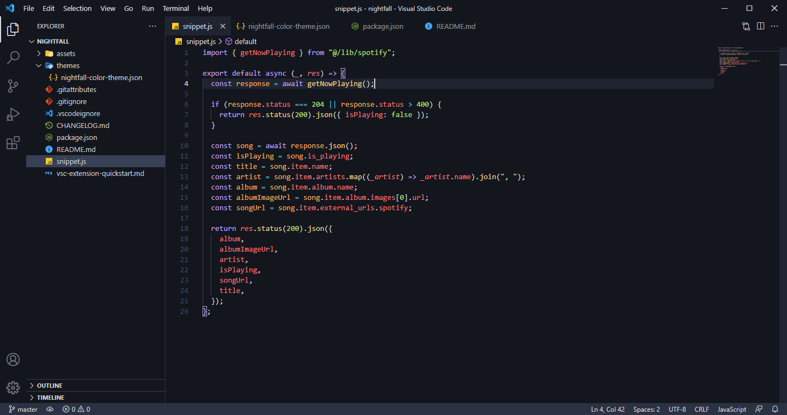

 
 

## Installation via VSCode

1. Open **Extensions** sidebar panel in VS Code. `View → Extensions`
2. Search for `nightfall`
3. Click **Install** to install it
4. Click **Reload** to reload the editor
5. Type `control + k` `control + t` and select nightfall theme.
